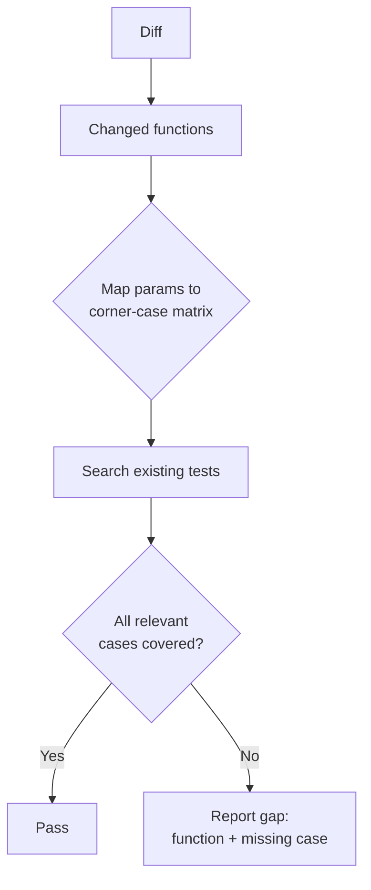

# Corner-Case Checklist

For every function touched in a diff, this skill checks whether its **behavior**
at the edges — not just its happy path — is *actually verified*. A function that
only works for "normal" input is a bug waiting for `[]`, `0`, or `-1`. The goal
is coverage of `undefined`, boundary values, and off-by-one positions, not just
line coverage.

## When this runs

Run this after `git diff` shows a changed function signature or body, before
the PR gate closes it out. It complements [react-testing-library](../react-testing-library/SKILL.md)
(how to write the test) and [pr-self-review](../pr-self-review/SKILL.md) (when
in the workflow this fires).

## The checklist

For each changed function, confirm each relevant box is checked by an existing
or new test:

- [ ] **Empty input** — `[]`, `""`, `{}`, empty `Map`/`Set`
- [ ] **Zero** — `0`, `0n`, `0.0` where the function does arithmetic or division
- [ ] **Negative** — negative numbers where the domain doesn't explicitly forbid them
- [ ] **First item** — index `0` / head of a list
- [ ] **Last item** — index `length - 1` / tail of a list
- [ ] **Single-item collection** — first and last are the same element
- [ ] **At-the-limit values** — `Number.MAX_SAFE_INTEGER`, `Number.MIN_SAFE_INTEGER`, max string/array length the function accepts
- [ ] **Null / undefined** — for any parameter typed as optional or nullable

## Corner case → example → what to check

| Corner case      | Example input           | What to verify                                  |
| ----------------- | ------------------------ | ------------------------------------------------ |
| Empty input        | `parseItems([])`         | Returns `[]`/default, doesn't throw               |
| Zero                | `applyDiscount(0)`        | No division-by-zero, no `NaN` propagation         |
| Negative            | `daysUntil(-3)`           | Either rejected explicitly or handled, not silently wrong |
| First item          | `getRank(list, 0)`        | No off-by-one against the start boundary          |
| Last item           | `getRank(list, n - 1)`    | No off-by-one against the end boundary            |
| At-the-limit        | `chunk(arr, MAX_CHUNK)`   | No overflow, no truncation, no infinite loop      |

> **Note:** Floating-point "at-the-limit" checks are a special case — `0.1 + 0.2
> !== 0.3` in JS, so equality assertions near limits should use an epsilon
> comparison rather than `===`.

## Example: function under review

```ts
function firstNonEmpty(items: string[]): string | undefined {
  for (const item of items) {
    if (item.length > 0) return item;
  }
  return undefined;
}
```

## Example: test skeleton exercising the checklist

```ts
describe("firstNonEmpty", () => {
  it("returns undefined for empty input", () => {
    expect(firstNonEmpty([])).toBeUndefined();
  });

  it("handles a single-item collection", () => {
    expect(firstNonEmpty(["a"])).toBe("a");
  });

  it("skips empty strings at the start", () => {
    expect(firstNonEmpty(["", "", "b"])).toBe("b");
  });

  it("returns undefined when the last item is also empty", () => {
    expect(firstNonEmpty(["", ""])).toBeUndefined();
  });
});
```

## Workflow

1. Identify changed functions in the diff.
   1. Skip pure re-exports, type-only changes, and generated code.
   2. Keep only functions with new or modified logic branches.
2. Map each function's parameters to the relevant rows of the checklist above.
   - Not every function needs every row — a function with no numeric input
     doesn't need the zero/negative checks.
3. Search existing tests for coverage of each mapped corner case.
4. Report gaps: which corner cases have no covering test, with the file and
   function name.

## Decision flow



---

## See also

- [react-testing-library](../react-testing-library/SKILL.md) — how to write the
  covering test once a gap is found
- [pr-self-review](../pr-self-review/SKILL.md) — the gate this skill plugs into
