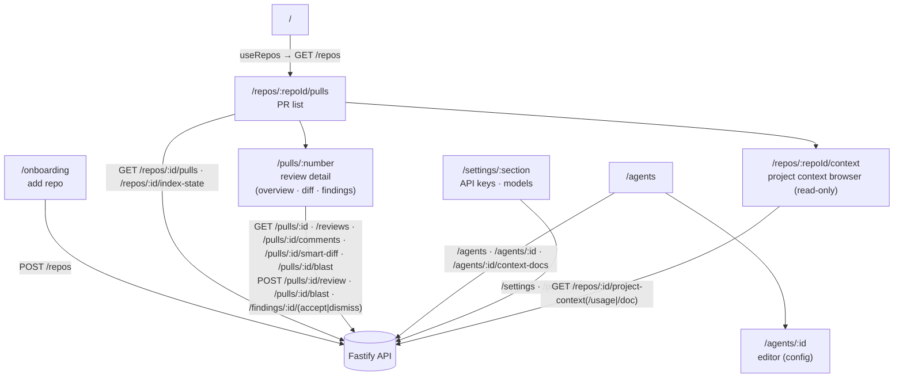

# `@devdigest/web` — the studio (Next.js 15)

The DevDigest UI: import repos, browse pull requests, run and read AI reviews,
and author agents. App Router + React Server/Client components, data via
**TanStack Query** hooks over the Fastify API. (This is the starter surface;
course lessons add the Skills, Memory, Eval, Blast/Brief, multi-agent, CI, and
dashboard screens.)

- **Stack:** Next.js 15 (App Router), React 19, TanStack Query, `next-intl`
  (messages in `messages/<locale>/*.json`), `recharts`, `mermaid`,
  `react-markdown`. UI primitives are vendored under `src/vendor/ui`
  (`@devdigest/ui`) and shared Zod contracts under `src/vendor/shared`
  (`@devdigest/shared`).
- **API base:** `NEXT_PUBLIC_API_BASE` (default `http://localhost:3001`), used by
  `src/lib/api.ts`. Every data hook lives in `src/lib/hooks/*`.
- **Run:** `pnpm dev` (`:3000`). **Test:** `pnpm test` (vitest + jsdom, fetch
  mocked — no API needed). **Typecheck:** `pnpm typecheck`.

## UI route map

Routes (`src/app/**/page.tsx`) and the API surface each leans on (via
`src/lib/hooks/*` → `src/lib/api.ts`):

Cross-cutting chrome lives in `src/components/app-shell` (nav, breadcrumbs,
`g`-then-key shortcuts). Pages are thin; feature logic sits in colocated
`_components/<Name>/` folders, each with its own `*.test.tsx`.

`src/components/context-tab/` is a shared app-level component (not
`src/vendor/ui`) for an agent's or a skill's Project Context document
attachments — mounted from both the Agent editor (`/agents/:id`) and the
Skill detail pane (`/skills`), so the two owners never diverge on the
attach/detach/reorder behaviour. There is no staged Save/Discard: each tick,
untick or drop persists immediately via `useSetAgentContextDocs`/
`useSetSkillContextDocs` (`src/lib/hooks/project-context.ts`), optimistically
and with cancel-and-replace for a fast double-action. The tab renders one
merged list (attached first, then unattached), a path filter, and an inline
preview drawer via `useProjectContextDoc`, which also backs the
`/repos/:repoId/context` page's own preview pane. See
[`../docs/project-context.md`](../docs/project-context.md) for the full
discovery-through-injection picture.

### Cards with two asymmetric calls

`BlastRadiusCard` (PR Overview, `_components/BlastRadiusCard/`) is the pattern
to copy when a card has a free deterministic payload and an optional paid one.
`useBlastRadius` GETs the whole impact map on mount and costs nothing;
`useDeriveBlastSummary` POSTs to the same path to spend one LLM call on a
sentence, and seeds the query cache from its response instead of invalidating —
the map in that response is identical, so a refetch would recompute the graph
server-side for no new information.

Two rules the card exists to hold, both about `index.state`
(see [`../server/src/modules/blast/README.md`](../server/src/modules/blast/README.md)):

- **`unavailable` never renders a zeroed stat row.** An empty map reads exactly
  like "nothing depends on this", so the card shows an `EmptyState` carrying the
  server's own explanation instead. `partial` keeps its map but wears a warning
  badge listing `files_not_covered`.
- **A `path:line` with no repo name or head sha renders as plain text, not a
  link.** A URL guessed against the wrong ref opens the right file at the wrong
  line, which is worse than no link. Links go through `githubBlobUrl` and are
  pinned to the PR head.

The Graph view builds its Mermaid source in a pure `graph.ts` with its own
tests: node ids are generated (`n0`, `n1`, …) and never derived from a path, and
labels are quoted with `"` escaped to `#quot;`. `MermaidDiagram` renders nothing
on unparseable input, so an escaping bug fails silently — which is why the string
builder is tested directly rather than through the rendered diagram.

## Testing

Component/interaction tests (`*.test.tsx`) run under vitest + jsdom with `fetch`
mocked, so they need neither the API nor a browser. The real browser journeys
(client + API + seeded DB) are covered by the deterministic agent-browser suite
in [`../e2e`](../e2e/README.md) and the `e2e-web.yml` workflow. See
[`../TESTING.md`](../TESTING.md).
