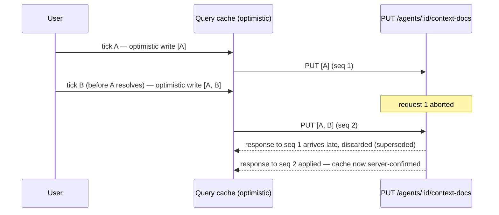
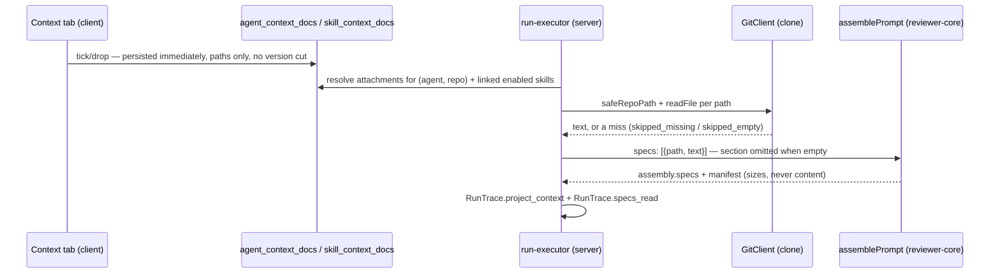

# Project context

How a reviewer agent gets access to a repo's own `.md` rules — specs, docs and
insights already sitting in the clone — without anyone pasting them into a
system prompt by hand. Spans `server`, `client`, `reviewer-core` and
`@devdigest/shared`; the agreed design, including the full decision record for
revisions 2 and 3 below, is
[`../specs/2026-08-23-project-context.md`](../specs/2026-08-23-project-context.md)
(`Status: shipped`, v1 + revision 2 + revision 3 all built).

## Discovery

`GET /repos/:id/project-context` lists every `.md` file under
`**/{specs,docs,insights}/**/*.md` in the repo's clone — path, type
(`specs`/`docs`/`insights`, derived from which root matched), byte size and an
estimated token count. Discovery stops at 2,000 files and reports
`truncated: true` rather than walking an unbounded tree
(`server/src/modules/project-context/domain-model/constants.ts`).
`GET /repos/:id/project-context/usage?path=` returns how many enabled agents
would receive a given document in a run of that repo, counting both direct
attachments and inheritance through a linked, enabled skill.

`GET /repos/:id/project-context/doc?path=` (revision 2) returns
`ProjectContextDocContent` — a document's own rendered-ready text, byte and
token counts, and a `truncated` flag. It only serves a `path` that is a
member of the *current* discovery listing for that repo (`422` otherwise) and
the same `409 repo_not_cloned` the listing route already uses. Two size
guards apply, in order: `ProjectContextService.readDoc()`
(`application-services/project-context-service.ts`) rejects a document whose
known `bytes` (from the discovery walk's `stat()`) exceed
`MAX_DOC_READ_BYTES` (1 MiB) with a `422` **before** reading it into memory —
a request-reachable size cap, distinct from the truncation below — and then
truncates the text it did read to `MAX_DOC_CHARS`, the same slice a run would
inject (`doc.truncated`). This route is what powers both in-studio previews
below; before it existed, nothing served a document's text to the browser at
all.

The client page is `client/src/app/repos/[repoId]/context` — a read-only
document browser (list + a real markdown preview, revision 2/3). There is no
create/upload/edit/rename/delete; the clone has no write path from the
studio.

Token counts are estimates (`≈`) from `TiktokenTokenizer` /
`approxTokens()`, never billed quantities.

## Attaching documents

Two link tables carry the attachment, each scoped to one repo because an
agent or skill is workspace-scoped but a document lives inside one repo's
clone:

- `agent_context_docs (agent_id, repo_id, path, order)`
- `skill_context_docs (skill_id, repo_id, path, order)`

Only the path is stored, never the text — the text is read from the clone at
run time, so an attachment can never go stale against the document it names.

The UI is a shared component, `client/src/components/context-tab/`, mounted
in both the Agent editor
(`client/src/app/agents/[id]/_components/AgentEditor/_components/ContextTab/`)
and the Skill detail pane
(`client/src/app/skills/_components/SkillsLabView/_components/SkillDetailPane/_components/tabs/ContextTab.tsx`).

**Attachments are a mutable meta layer, not versioned configuration
(revision 3).** A tick, an untick, or a completed drag-reorder persists
**immediately** — one `PUT /agents/:id/context-docs` or
`PUT /skills/:id/context-docs` call per discrete action, carrying the full
ordered path list. There is no staged edit state, no Save, no Discard: the
component renders the attachment set straight out of the TanStack Query
cache rather than mirroring it into local `useState`
(`client/src/lib/hooks/project-context.ts`'s `useSetAgentContextDocs`/
`useSetSkillContextDocs`, replacing v1's now-removed
`useSaveAgentContextDocs`/`useSaveSkillContextDocs`). Persisting an
attachment change writes **no** `agent_versions` / `skill_versions` row and
bumps no `version` — `AgentRepository.snapshotVersion`'s config whitelist and
`SkillRepository`/`AgentRepository`'s change-detection predicates
(`isConfigChange`, `isSkillConfigChange`) carry no attachment field any more,
and the `skill_versions.context_json` column v1 added was never shipped and
is gone. Restoring an earlier agent or skill version restores that version's
other configuration fields only — it leaves the current attachment set
completely untouched, because the attachment set was never part of any
version's snapshot to restore. The trade is explicit: "which documents did
this agent have last Tuesday" is no longer an answerable question.

Each mutation applies an optimistic update before its `PUT` resolves, and the
hook cancels any in-flight request for the same owner+repo before issuing the
next one (`AbortController` cancel-and-replace, keyed by a monotonic `seq`),
so a fast double-tick or a tick during an in-flight drag-commit can never let
a stale response clobber a newer optimistic state. On failure the list rolls
back to the last known-persisted state and an error toast reports it — there
is nothing to Discard, because nothing was ever staged.



## Context tab presentation

The Context tab renders **one merged document list** (revision 2), not v1's
separate checkbox list plus staged-reorder list: attached documents first, in
injection order, followed by unattached documents in path order. A drag
handle appears only on an attached row; the filter input (client-side,
evaluated against the already-fetched listing, no extra request per
keystroke) narrows which rows show without ever changing what is attached,
and disables drag-reordering while active, since a row's position in a
filtered view no longer corresponds to its position in the injection order.
Each row shows its filename first and its containing directory second, a
type badge (`specs`/`docs`/`insights`, colour **and** text, never colour
alone), and a `Preview` control; the per-document token count is gone from
the row and lives only in the `Serializes as` block below the list, with the
staged set's total in the tab's footer. A `Project context — <N> of <M>
attached` counter sits beside the heading, unaffected by the filter.

`Preview` (revision 2) opens a right-side `Drawer`
(`client/src/components/context-tab/DocPreviewDrawer.tsx`) — not a v1
`Browse all documents` link, which is gone now that every row previews
inline — titled with the document's path, carrying its type badge and
`Used by N agents` count in the same header row, and rendering the document's
markdown via `useProjectContextDoc` (react-markdown, no raw HTML, no
`dangerouslySetInnerHTML`). Opening, reading or closing the drawer never
touches the attachment set; closing it returns keyboard focus to the
`Preview` control that opened it.

## The browser page

`/repos/:repoId/context` (`ProjectContextView`) keeps its list-plus-preview
layout, but the preview pane is now a real document reader rather than a
metadata card: it renders the selected document's markdown via
`useProjectContextDoc`, alongside its type, byte size, `≈` token count and
`Used by N agents` count, all in the same header row as the path. The `+`,
new-folder and `Upload` toolbar controls are **removed**, not disabled —
authoring stays a confirmed non-goal — and a `Refresh` control replaces them,
re-running discovery on demand (`useProjectContext(repoId)`'s own `refetch`)
so a document added by a `sync` since the page opened appears without a full
navigation away and back. `Refresh` also invalidates the selected document's
content and usage queries, so an open preview doesn't keep serving
pre-refresh data for the query cache's 30s `staleTime`; if the fresh listing
no longer contains the previously selected path, the preview pane clears
rather than showing stale content. `Preview` itself is no longer disabled —
only `Edit` stays disabled behind the read-only tooltip.

## Injection at run time

A run resolves its attachments once, at run start — an in-flight run does not
see edits made after it started. Resolution
(`server/src/modules/project-context/domain-services/resolve.ts`) is a pure
function over already-read candidates:

1. The agent's own attachments, in their saved `order`.
2. Then each linked **and enabled** skill's attachments, in link order.
3. Deduplicated by repo-relative path — the first occurrence (always the
   agent's own, if present) wins its position.

Each candidate gets one `ProjectContextStatus`:

| Status | When |
|---|---|
| `included` | read, non-empty, fits the budget |
| `truncated` | exceeds the 2,000-token (`MAX_DOC_TOKENS`) per-document cap — truncated and still injected |
| `skipped_budget` | the accumulated block is already at/over the 8,000-token (`MAX_CONTEXT_TOKENS`) per-run budget |
| `skipped_missing` | the path no longer resolves to a readable file in the clone |
| `skipped_empty` | the file resolves but is 0 bytes / whitespace-only |
| `skipped_other_repo` | a skill-inherited document whose `repo_id` isn't the repo under review |

Both budget numbers are the spec's ship-and-revisit numbers (Open questions,
Q3) — chosen for coherence with the existing `MAX_SPEC_CHARS` in
`server/src/modules/reviews/intent/gather.ts`, not derived from measurement.

`reviewer-core`'s `PromptParts.specs` widened from `string[]` to
`Array<{ path: string; text: string }>` (`ReviewInput.specs` with it) so the
model can name the document it cites. `assemblePrompt` emits, once per
included/truncated document, in resolution order:

```
## Project context
### <repo-relative path>
<untrusted source="spec:<repo-relative path>">
<document text>
</untrusted>
```

`sanitizeHeadingPath()` (`reviewer-core/src/prompt.ts`) guards the `###`
heading; the `<untrusted>` wrapper plus the system-message `INJECTION_GUARD`
are the fence — a skill-inherited document is trusted-object-carrying-
untrusted-payload, and always lands in this block, never in the trusted
`## Skills / rules` section. Zero resolved attachments omits the whole
section, matching the omit-when-empty idiom already used for `repoMap`,
`skills` and `callers`.

## The run trace

`RunTrace.project_context: ProjectContextInjected[]` records every resolved
candidate — path, type, tokens, status, `inherited_from` (the skill name, or
`null` for a direct attachment) — but never document text.
`RunTrace.specs_read` (unchanged `string[]` shape) is the subset of paths with
status `included` or `truncated`, feeding the existing `Specs read:` row.

In the run trace drawer
(`client/src/app/repos/[repoId]/pulls/[number]/_components/RunTraceDrawer/`),
a `Project context — attached specs (untrusted)` row
(`_components/ProjectContextRow/`) appears in the Prompt assembly list right
after `Skills — enabled skill bodies` and before `Repo skeleton —
repo-intel (dynamic)`, and is omitted entirely when nothing was injected. Its
expand control opens a dialog with the full verbatim `prompt_assembly.specs`
text, a scoped search box and a copy control; skipped or truncated documents
show their status next to their path.

## Where the code lives



- `server/src/modules/project-context/` — onion-layered: `domain-model`
  (types, constants), `domain-services` (`discovery.ts`, `resolve.ts`,
  `ports.ts`), `application-services` (`ProjectContextService`, including
  `readDoc()` behind the content route), `infrastructure/{http,external,
  persistence}` (routes, `CloneFileSource` over `GitClient`, the usage-count
  repository). Three routes live here — listing, usage, and the content
  route (`GET /repos/:id/project-context/doc`). The four attach/detach/
  reorder routes (`GET`/`PUT /agents/:id/context-docs`,
  `GET`/`PUT /skills/:id/context-docs`) live on the agents and skills modules
  instead, since they address an agent or a skill rather than a repo, and no
  longer call `snapshotVersion`.
- `server/src/vendor/shared/contracts/project-context.ts` (mirrored in
  `client/src/vendor/shared/`) — `ProjectContextDocType`, `ProjectContextDoc`,
  `ProjectContextListing`, `ProjectContextAttachment`,
  `ProjectContextStatus`, `ProjectContextInjected`, and (revision 2)
  `ProjectContextDocContent = { path, type, bytes, tokens, text, truncated }`
  — the one type in this family that carries document text, deliberately: it
  is a response body read once per preview open, never persisted to the run
  trace or the run log, so it is not the same no-text rule
  `ProjectContextInjected` follows.
- `server/src/vendor/shared/adapters.ts` — `GitClient.listFiles(repo, {
  globs, maxFiles })`, the one new port method, added alongside the existing
  `readFile`/`clonePathFor` and confined by the same `safeRepoPath` rule.
- `reviewer-core/src/prompt.ts`, `reviewer-core/src/review/run.ts` — the
  `specs` slot and `sanitizeHeadingPath()`.
- `client/src/lib/hooks/project-context.ts` — `useProjectContext`,
  `useProjectContextUsage`, `useProjectContextDoc` (the content route, new in
  revision 2), `useAgentContextDocs`/`useSkillContextDocs` (read) and
  `useSetAgentContextDocs`/`useSetSkillContextDocs` (revision 3's immediate,
  cancel-and-replace write — replacing v1's removed
  `useSaveAgentContextDocs`/`useSaveSkillContextDocs`).
- `client/src/components/context-tab/` — the shared merged-list, filter and
  inline-preview UI (`ContextTab.tsx`, `DocPreviewDrawer.tsx`, `helpers.ts`);
  mounted from the Agent editor and the Skill detail pane.
- `client/src/app/repos/[repoId]/context/` — the read-only document browser
  page (`ProjectContextView`, `DocList`, `DocPreview`), now with a real
  markdown preview pane and a `Refresh` control in place of the removed
  authoring toolbar.
