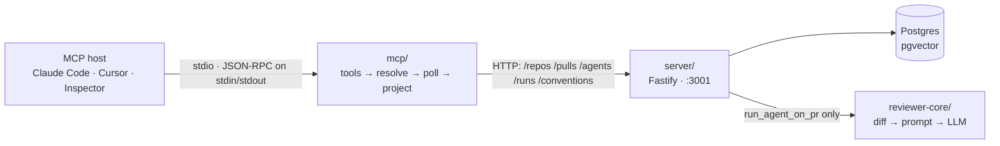

# `@devdigest/mcp` — local stdio MCP server

Exposes DevDigest's review loop to any **MCP host** (Claude Code, Cursor, the MCP
Inspector) over **stdio**, so an agent working inside a codebase can list
reviewers, run one over a pull request, read the findings, and pull the repo's
extracted conventions without leaving its editor.

It is a thin **translation layer**, not a second backend: no database, no
Drizzle, no DI container. Every tool is `fetch` against the Fastify API on
`:3001`, which runs locally without auth and without a route prefix. The
translation is the value — flat human arguments in (`repo`, `pr`, `agent` as
strings and ints, never uuids or objects), one concise structured result out.

## Request path



The host **spawns** this process; it is not a daemon and nothing in the running
stack imports it. stdout carries the JSON-RPC frames, so all logging goes to
stderr.

## Tools

| Tool | Arguments | Returns |
|------|-----------|---------|
| `list_agents` | *(none)* | Every configured reviewer agent: `name`, `description`, `provider`, `model`, `enabled`, `id`. The `name` values are exactly what `run_agent_on_pr` accepts. |
| `run_agent_on_pr` | `repo`, `pr`, `agent` | Resolves, starts the run, **blocks** until it finishes, and returns the full review result. On the happy path nothing else needs calling. |
| `get_findings` | `repo`, `pr`, `agent?`, `run_id?`, `max_findings?` (default 20, 1–100) | The result of a review that already ran. Omit `agent` for the most recent review by any agent; `run_id` addresses one exact run and wins over `agent`. |
| `get_conventions` | `repo` | The repo's human-accepted convention rule set as markdown (rule sentences and `path:line` citations, never source snippets) plus the files it was learned from. |
| `get_blast_radius` | `repo`, `pr` | What a PR can impact: changed symbols, their callers (20 per symbol, highest file-rank first), and the HTTP endpoints and cron jobs downstream. Every node is read from the code index; only `summary` is model-written. Callers and downstream arrive pre-joined onto each symbol, and the symbol list itself is cut to 20 with `truncated`. Always check `index.state`. |

`run_agent_on_pr` and `get_findings` share one result shape: `status`
(`completed` · `still_running` · `failed` · `not_reviewed`), `verdict`, a 0–100
`score` where higher is better, `summary`, severity `counts`, up to
`max_findings` findings ordered CRITICAL → WARNING → SUGGESTION, plus
`total_findings` / `truncated`, and a `next_step` on every non-`completed`
status. `run_id` is the only identifier in the payload — everything else is
addressed by meaning.

Only `run_agent_on_pr` writes anything or costs money: it makes real LLM calls
against the agent's configured model. It blocks for up to 5 minutes; if the cap
is hit it returns `status: "still_running"` with the `run_id` rather than
stranding the run, and the caller polls with `get_findings`.

`get_blast_radius` reads `GET /pulls/:id/blast` and never the POST beside it.
The POST re-derives the one-sentence summary and spends money, which a tool
annotated `readOnlyHint: true` must not do — so the tool is free, and `summary`
comes back `null` on a PR whose sentence was never derived in the UI. Its one
special rule: an **unusable** index is an error, not a success with empty
arrays, because a model reading `changed_symbols: []` concludes "nothing is
affected, merge it". A `partial` index is not an error — it returns the map with
`index.explanation` and `files_not_covered` so the caller can see the hole.

Every failure is one of a catalogue of coded errors, each naming both the cause
and the next action (`Cannot reach the DevDigest API at … Start it with
./scripts/dev.sh`). An API error message is echoed at most 300 characters and
never its `details`.

## Setup

**npm, not pnpm** — this package has its own `package-lock.json`, like
`reviewer-core/` and `e2e/`. Node **≥22** (what the repo targets; `npm ci` and
the test suite expect it).

```sh
cd mcp && npm ci
```

That is the whole install. Nothing else in the repo depends on this package, so
`./scripts/dev.sh` does **not** install it for you.

### Nothing starts this server automatically

By design, and worth stating plainly because it is easy to mistake for a missing
step:

- **`./scripts/dev.sh` never starts it.** The script boots Postgres, the API and
  the web app. It contains no reference to `mcp/` at all. A stdio server has no
  port and no daemon to supervise — it is spawned by whichever host wants to
  talk to it, one process per connection, and exits when that host disconnects.
- **Registering it with a host is a separate, opt-in step** (below). Until you
  do that, or run it by hand, nothing in this package ever executes.

You *do* need the API running before any tool call succeeds, since every tool is
an HTTP call against it:

```sh
./scripts/dev.sh --no-client     # Postgres + API on :3001 (skip the web app)
curl -s localhost:3001/health    # {"status":"ok"}
```

## Run it

Three ways, in increasing order of setup. Start with (a) — it proves the server
works before any host or API is involved.

### (a) By hand, no host and no API — the 10-second check

The server speaks JSON-RPC on stdin/stdout, so a pipe is a complete client:

```sh
cd mcp
printf '%s\n' '{"jsonrpc":"2.0","id":1,"method":"tools/list","params":{}}' \
  | npx tsx src/index.ts
```

You should get all five tools back. Calling one works the same way:

```sh
printf '%s\n' '{"jsonrpc":"2.0","id":1,"method":"tools/call","params":{"name":"list_agents","arguments":{}}}' \
  | npx tsx src/index.ts
```

With the API down that returns an error — which is itself a passing result, and
the fastest way to see the error style:

> Cannot reach the DevDigest API at http://localhost:3001. Start it with
> `./scripts/dev.sh`, then call this tool again. Set DEVDIGEST_API_BASE if the
> API runs on another port.

`npm start` does the same thing without the pipe; bare, it waits for a client,
which looks like a hang but is correct.

### (b) MCP Inspector — a UI for poking at schemas

```sh
cd mcp && npx @modelcontextprotocol/inspector ./node_modules/.bin/tsx src/index.ts
```

Best for reading the generated input/output schemas and trying arguments without
writing JSON by hand. Launched from inside `mcp/`, so it needs no `--tsconfig`.

### (c) A real host (Claude Code, Cursor)

See registration below. This is the only mode where the tools appear to an agent
as `mcp__devdigest__*`.

## Register with a host — opt-in

**This repo does not ship a live registration.** `.mcp.json` is gitignored; what
is committed is `.mcp.json.example`. Nothing spawns this server until you
deliberately do one of the following.

**Option 1 — copy the template** (project-scoped, applies to this repo only):

```sh
cp .mcp.json.example .mcp.json      # from the repo root
```

Then restart your host. Claude Code prompts once for approval, after which the
tools are available in every session opened in this directory. **That is the
auto-start** — if you want the server to run only occasionally, delete
`.mcp.json` and use (a) or (b) instead. Because it is gitignored, your choice
stays local and is never imposed on a teammate.

**Option 2 — register via the CLI**, without a file:

```sh
claude mcp add devdigest --scope project -- \
  ./mcp/node_modules/.bin/tsx --tsconfig ./mcp/tsconfig.json ./mcp/src/index.ts
```

The committed template, for reference:

```json
{
  "mcpServers": {
    "devdigest": {
      "command": "./mcp/node_modules/.bin/tsx",
      "args": ["--tsconfig", "./mcp/tsconfig.json", "./mcp/src/index.ts"],
      "env": {
        "DEVDIGEST_API_BASE": "http://localhost:3001"
      }
    }
  }
}
```

Two details in there are load-bearing, and both cost real debugging time:

- **The package-local `tsx` binary.** The repo root has no `node_modules`, so
  `npx tsx` would resolve nothing and try to download.
- **`--tsconfig` is not decoration.** A host spawns this from the *repo root*,
  and `@devdigest/shared` resolves only through this package's tsconfig `paths`.
  Without the flag the server dies at import with
  `ERR_MODULE_NOT_FOUND: Cannot find package '@devdigest/shared'`. Running from
  inside `mcp/` works without it — which is precisely why the failure appears
  only once a host launches it, and never during local testing.

Paths are relative to the repo root; a host that spawns with a different working
directory needs absolute ones.

## Using the tools

Examples use the seeded demo data: repo `acme/payments-api`, PR **#482**. The
seeder creates four agents — `General Reviewer`, `Security Reviewer`,
`Performance Reviewer`, `Test Quality Reviewer` — and a workspace that has had
agents added in the UI will list more, so treat `list_agents` as the source of
truth rather than this list.

| Call | Arguments | What you get |
|------|-----------|--------------|
| `list_agents` | `{}` | Every configured agent. Start here — its `name` values are exactly what `agent` accepts. |
| `get_findings` | `{"repo":"acme/payments-api","pr":482}` | The most recent review for that PR, or a message pointing at `run_agent_on_pr` if none exists yet. Free. |
| `get_conventions` | `{"repo":"acme/payments-api"}` | The accepted convention rules as markdown. On a **fresh seed this returns "no conventions extracted yet"** — see Troubleshooting. Free. |
| `get_blast_radius` | `{"repo":"acme/payments-api","pr":482}` | The PR's impact map. On a **freshly seeded repo the index may not be built**, which returns a leads-forward error rather than an empty map — see Troubleshooting. Free. |
| `run_agent_on_pr` | `{"repo":"acme/payments-api","pr":482,"agent":"General Reviewer"}` | ⚠️ **Spends money.** Runs a real review and blocks 20–90s. |

`repo` accepts `owner/name`, or a bare name when unambiguous. `pr` is the number
shown on GitHub, not a database id. `agent` is a name, or an id when two agents
share a name.

**About `run_agent_on_pr`:** it needs an LLM key configured in DevDigest →
Settings, and it charges for every call. Without a key it returns
`status: "failed"` naming the missing key rather than hanging. If it exceeds its
5-minute cap it returns `status: "still_running"` with a `run_id` — the run is
still going server-side, so call `get_findings` with that `run_id` a minute
later instead of starting a second run.

## Configuration

All optional; read once at module load in [`src/config.ts`](src/config.ts). A
malformed value falls back to its default silently, because warning on stdout
would corrupt the protocol.

| Env var | Default | What it does |
|---------|---------|--------------|
| `DEVDIGEST_API_BASE` | `http://localhost:3001` | Base URL of the Fastify API. Trailing slashes are stripped. |
| `DEVDIGEST_MCP_RUN_TIMEOUT_MS` | `300000` | How long `run_agent_on_pr` blocks before returning `still_running`. Raise it for slow models, lower it for hosts with a short per-call timeout. |
| `DEVDIGEST_MCP_TOOL_PREFIX` | *(empty)* | Prefix for tool names. An escape hatch for hosts that flatten names across servers; Claude Code already namespaces client-side, so it stays empty by default. |

The remaining knobs — poll interval, truncation caps, the default findings cap —
are constants in the same file, not env vars.

## Troubleshooting

| Symptom | Cause | Fix |
|---------|-------|-----|
| `ERR_MODULE_NOT_FOUND: Cannot find package '@devdigest/shared'` | Launched from the repo root without `--tsconfig`. | Use the exact `command` + `args` from `.mcp.json.example`. |
| *"Cannot reach the DevDigest API at …"* | The API is not running. | `./scripts/dev.sh --no-client`, then `curl -s localhost:3001/health`. |
| *"No agent named 'x'. Call list_agents …"* | The `agent` string doesn't match. | The error lists the valid names; or call `list_agents`. Names are matched case-insensitively. |
| *"N agents are named 'x' …"* | Two agents share a name — the DB has no unique constraint on it. | Pass the agent **id** the message lists instead of the name. |
| *"Pull request #N is not imported for …"* | The PR exists on GitHub but not in DevDigest. | Open the repo's Pull requests page in the DevDigest UI once to import it. |
| *"No conventions have been extracted for … yet"* | **Expected on a fresh seed** — the seeder creates no conventions run. Not a bug. | DevDigest → Conventions → run the extractor, then accept the rules you agree with. |
| *"… candidates but none has been accepted yet"* | The extractor ran, but nobody accepted any rules, so there is no rule set to return. | Accept the correct ones in the UI, then call again. |
| `relation ... does not exist` from the API | Migrations were never run — they do **not** run on boot. | `cd server && pnpm db:migrate` |
| `get_blast_radius` says the index is unavailable | Usually the repo has not been indexed yet, so there is no call graph to walk. The same error also covers "the PR's changed files were never imported" and "not one changed file is in the index" — the message carries the server's own explanation, so read it before acting. This is deliberately an error and **not** an empty map, which would read as "nothing is affected". | Repos → the repo → **Re-analyze**, wait for the **Indexed** badge, then call again. If the explanation names the file list instead, open the PR once in the DevDigest UI to import it. |
| `get_blast_radius` returns `index.state: "partial"` | **Not a bug.** Some changed files are in languages the index does not parse (it reads `.ts/.tsx/.js/.jsx/.mjs/.cjs`), are new since the last index run, or were skipped. | Read `index.explanation` and `files_not_covered`. The map is real but incomplete — do not read it as exhaustive. |
| Tools don't appear in the host at all | No `.mcp.json` (the default — registration is opt-in), or the approval prompt was declined. | `cp .mcp.json.example .mcp.json`, restart the host, accept the prompt. |
| The server "hangs" when started bare | Correct behaviour — it is waiting for a client on stdin. | Pipe it a JSON-RPC frame, or launch it from a host. |
| A tool call returns `isError` with no detail | An API error is echoed at most 300 chars and its `details` is never included, deliberately. | Read the API's own terminal output for the full error. |

Logs go to **stderr** — stdout is the JSON-RPC channel and cannot carry
diagnostics. In Claude Code, the server's stderr appears in the MCP log.

## Testing

```sh
npm test           # vitest, hermetic — fetch is stubbed, no API and no network
npm run typecheck  # tsc --noEmit — this IS the build; the package emits no JS
```

Node **≥22**. The suite is 227 tests across 9 files and needs no database, no
API and no network.

No `*.it.test.ts` here: that suffix is the server's testcontainers-Postgres
selector and this package touches no database. See
[`../TESTING.md`](../TESTING.md).
