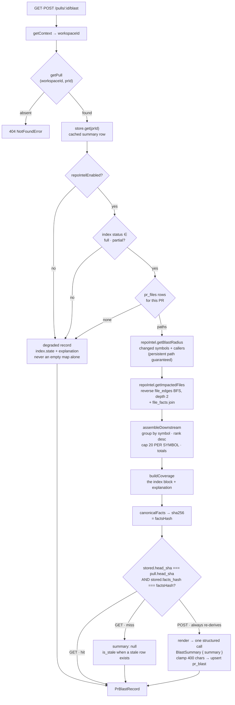
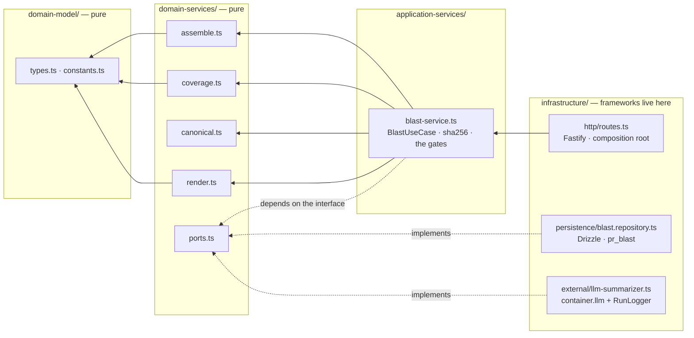

# `blast` — the PR impact map

Answers one question on the PR Overview page: **"what can this diff reach?"** —
the symbols declared in the changed files, the callers that import or call them,
and the HTTP endpoints and cron jobs downstream of those callers.

Every node is read from the [`repo-intel`](../repo-intel/README.md) Postgres
index. The **only** model-written text in the whole feature is a cached 1-2
sentence summary that describes the already-computed node list; it can never add
a node, drop one, or contradict a count.

Route contracts live in the API map in [`server/README.md`](../../../README.md#api-map-starter).
This file is about how the module works.

---

## The three rules that shape everything

### 1. An unknown map and an empty map are different answers

A blast map with nothing in it means either *"nothing depends on this"* or
*"we could not see"*. Conflating them tells a reviewer that a risky change is
safe — which is worse than showing no map at all. So the response always carries
an `index` block, and every surface refuses to present emptiness on its own:

| Surface | What it does with an unusable index |
| --- | --- |
| `domain-services/coverage.ts` | A non-`full` state **guarantees** a non-empty `explanation` plus a `files_not_covered` list naming the specific changed files the index could not see. Enforced with a final fallback sentence, not assumed. |
| `contracts/brief.ts` | `BlastIndexInfo` defaults to `state: 'unavailable'` — never `full`. A payload that forgot to say how much it saw cannot read as a complete answer. |
| `mcp/src/tools/get-blast-radius.ts` | `state: 'unavailable'` is raised as a `blast_index_unavailable` **error**, never a success with empty arrays. `partial` is not an error — a partial answer is still an answer. |
| `BlastRadiusCard.tsx` (client) | `unavailable` renders an `EmptyState` carrying the server's explanation instead of a zeroed stat row and an empty tree. `partial` keeps its map but wears a warning badge listing the missed files. |

`buildCoverage` is pure primitives-in / one-DTO-out precisely so this invariant
can be asserted as a *property* over every status × reason combination in
`server/test/blast-coverage.test.ts`, rather than case by case.

### 2. The model never invents a node

`buildSummaryMessages(nodes: BlastNodes)` accepts a `BlastNodes` **and nothing
else**. That type carries symbol names, `path:line` refs, endpoint/cron strings
and counts — there is no field on it that could hold a patch, a file body, or
author-written prose. The invariant is enforced by the type, not by discipline.

At the other end, `BlastSummary` is `{ summary: string }` and nothing else, so
there is no channel through which a fabricated caller could reach the response
even if the model tried to emit one. `blast-render.test.ts` asserts both ends:
one key on the output schema, extra fields stripped, and the node block wrapped
as data the model is told not to obey.

Do not widen `buildSummaryMessages` to take a diff, the PR title, or a
`Container`.

### 3. The ripgrep full-tree scan must stay unreachable

`repo-intel`'s fallback path (`container.codeIndex.symbols()` / `.references()`)
walks the **entire clone per symbol** with no cache, no cap and no timeout — see
`server/INSIGHTS.md`, Tool & Library Notes. `getBlastRadius` was the one facade
method that still fell through to it, including when `REPO_INTEL_ENABLED` was
off.

Three guards now stand between a request and that path:

1. `BlastUseCase.run` returns early on `repoIntelEnabled === false`.
2. It then returns early unless `getIndexState(repoId).status` is `full` or
   `partial`.
3. `RepoIntelService.getBlastRadius` carries its own permanent flag guard, so a
   future caller that skips 1 and 2 still cannot reach the scan.

With 1 and 2 passed, `tryPersistentBlast` is guaranteed to answer, so the
fallback below it is dead code on this path by construction.

---

## Request pipeline

Reading notes:

- **The three `DEG` edges are the point.** Each one still produces a valid
  `PrBlastRecord` whose `index` block says what was missing and why. `downstream:
  []` is only ever emitted alongside an honest `index.state`.
- **GET never spends money.** The route wires a `refusingSummarizer` that throws
  if called, so "the read path makes no LLM call" is a type-level guarantee
  rather than a code-reading exercise. Only `POST` gets the real adapter.
- **The nodes are never cached.** Only the sentence and its provenance land in
  `pr_blast`; the map is recomputed from the index on every request, so a reindex
  can never serve a stale map — it can only invalidate the sentence describing it.
- **`is_stale`** means a stored row exists whose `head_sha` *or* `facts_hash` no
  longer matches. A reindex alone can mark a summary stale, deliberately: the
  summary describes the nodes, and the nodes moved.

---

## Layering

Four onion rings, `conventions/` copied file-for-file. Dependencies point
inward only; the two outer rings are reachable from the inner ones exclusively
through the ports in `domain-services/ports.ts`.

| File | Owns |
| --- | --- |
| `domain-model/constants.ts` | Re-exports `MAX_CALLERS_PER_SYMBOL` from repo-intel rather than restating it (a second literal would let the two drift), plus `MAX_SUMMARY_CHARS = 400`. This module is the only place that *applies* the cap. |
| `domain-model/types.ts` | `BlastNodes` (the entire model input) and `CoverageInput` — primitives only, so the coverage rules test without a DB. |
| `domain-services/assemble.ts` | repo-intel rows → `downstream[]` + `totals`. Group by symbol, rank desc with a `file`/`line` tiebreak, cap 20 per symbol, dedupe and sort every string array. |
| `domain-services/coverage.ts` | The `index` block and its composed explanation. |
| `domain-services/canonical.ts` | The deterministic canonical **string** of the node set. |
| `domain-services/render.ts` | The system prompt and the node block. The single choke point for rule 2. |
| `domain-services/ports.ts` | `BlastPullReader`, `BlastSummaryStore`, `BlastSummarizer`. |
| `application-services/blast-service.ts` | The use case: the gates, the cache decision, `createHash('sha256')`, the `PrBlastRecord`. |
| `infrastructure/**` | Fastify, Drizzle, the LLM adapter. The only ring that names concrete infrastructure. |

Two consequences the rings force, which are easy to mistake for accidents:

- **The hash is split from the canonicalisation.** `domain-services` may not
  import `node:*`, so `canonical.ts` emits a string and `blast-service.ts`
  hashes it — the same split `reviews/intent/service.ts` uses.
- **The system prompt is a module-scoped const in `render.ts`, not a file in
  `src/prompts/`.** That route goes through `renderPrompt` →
  `loadPromptTemplate` → `node:fs`, which this ring may not import. Keeping it
  pure is what makes "the model never sees source" a hermetic unit test.

---

## Reading the graph

`blast/` owns **no Drizzle beyond `pr_blast`**. `file_edges`, `file_facts`,
`symbols` and `references` belong to repo-intel, so everything is read through
its facade. Two additions were made there for this feature:

- **`RepoIntelRepository.getImporters(repoId, files)`** — the batched reverse
  lookup `SELECT from_file, to_file FROM file_edges WHERE repo_id = $1 AND
  to_file = ANY($2)`. This is the query the `file_edges_repo_to_idx` index on
  `(repo_id, to_file)` exists for. Never widen `getEdges(repoId)` for this — that
  one returns every edge in the repo and is unusable per request.
- **`RepoIntelService.getImpactedFiles(repoId, changedFiles)`** — two batched
  `getImporters` rounds bounded by `BFS_DEPTH = 2`, seeded with the changed files
  in `visited` so they can never appear as their own downstream and a cycle
  (A→B→A) can never revisit a node, then one `getFileFacts` join for endpoints
  and crons. Sorted depth-then-path, because the facts hash depends on it.

**Endpoint attribution is file-granular and deliberately broad.** The index
knows which *file* declares an endpoint, never which handler, so an endpoint is
attributed to every changed symbol that reaches its file. UI and tool copy
therefore say "potentially touched", never "touched".

Two repo-intel corrections shipped alongside:

- The caller cap was **global**, not per symbol — a flat `sort().slice(20)` over
  the whole list silently dropped every caller of the second and later symbols as
  soon as the first symbol was popular. It now groups by `viaSymbol` first.
  `caller_count` reports the true pre-cap total so the card's "N callers" is
  honest even when only 20 are listed.
- `BlastChangedSymbol` gained `line`, and `BlastResult` gained `impactedCrons`
  (carried explicitly rather than derived from `factsByFile`, which is absent on
  the degraded path).

---

## Cache and storage

`pr_blast` (`src/db/schema/reviews.ts`, directly after `pr_intent` and shaped
exactly like it): `pr_id` is the primary key, `summary` is the only non-nullable
payload column, and `head_sha` + `facts_hash` together form the cache key.

> **The migration is generated but not applied.** `0014_purple_psylocke.sql`
> contains `CREATE TABLE "pr_blast"` plus unrelated `ALTER TABLE` statements for
> `findings` and `pr_intent`, emitted because the Drizzle snapshot was already
> behind `schema.ts` before this work (`0013_curvy_bromley.sql` is committed but
> missing from `_journal.json`). Those `ADD COLUMN`s carry no `IF NOT EXISTS`, so
> applying the file fails on any database where `0013` was run by hand. Running
> it is blocked on reconciling the journal, which is its own change — migrations
> are never hand-edited.

The `blast_summary` feature model (`contracts/platform.ts`) defaults to
`openrouter` / `deepseek/deepseek-v4-flash` and is user-selectable in Settings by
virtue of being in `FEATURE_MODELS`, which the Settings UI is driven from. An
unpriced model yields `cost_usd: null` — **never 0**, which would read as free.

---

## Consumers

| Consumer | What it calls |
| --- | --- |
| `BlastRadiusCard` on the PR Overview tab | `useBlastRadius` (GET, on mount) and `useDeriveBlastSummary` (POST, opt-in button). Tree and Mermaid-graph views, sha-pinned `path:line` GitHub links. See [`client/README.md`](../../../../client/README.md). |
| `get_blast_radius` MCP tool | `GET /pulls/:id/blast` only — never the POST, because a tool annotated `readOnlyHint: true` must not spend money. Projects the two parallel arrays into one pre-joined symbol list and caps it at 20 symbols. See [`mcp/README.md`](../../../../mcp/README.md). |

## Tests

All hermetic — fake ports and a fake `RepoIntel`, no Postgres, no model:

- `server/test/blast-assemble.test.ts` — the per-symbol cap (21 callers → 20
  kept, `caller_count: 21`, a second symbol keeps all of its own), rank order,
  deterministic tiebreaks, pre-cap totals.
- `server/test/blast-coverage.test.ts` — a non-`full` state always carries a
  non-empty explanation, unsupported extensions land in `files_not_covered`, the
  100-file GitHub truncation is reported.
- `server/test/blast-render.test.ts` — the one-field output schema, the prompt
  carrying nodes and only nodes, injection text staying inside the data block.
